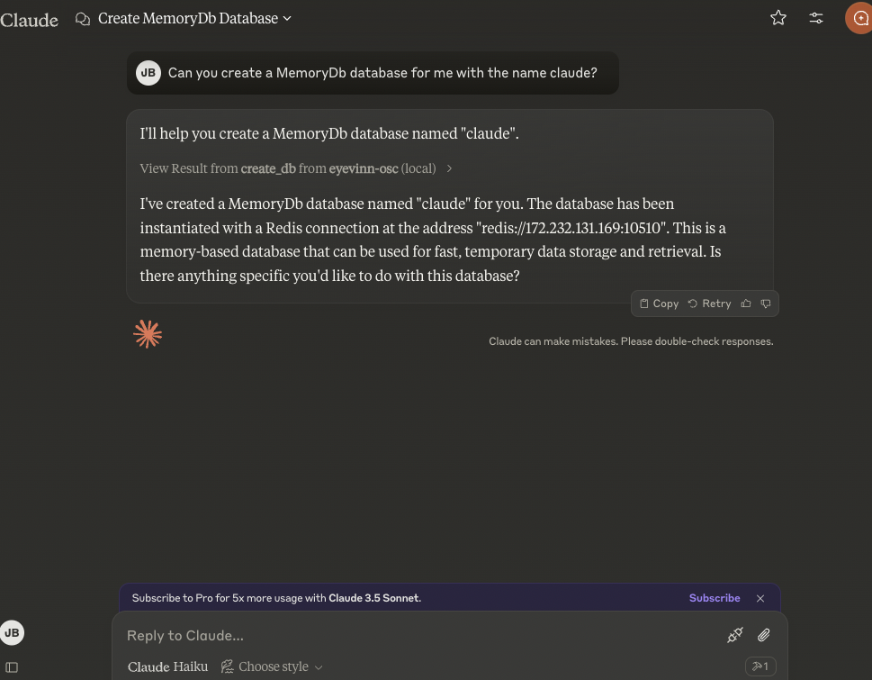

# Eyevinn Open Source Cloud MCP Server

MCP Server for [Eyevinn Open Source Cloud](www.osaas.io) API, enabling creation of solutions based on open web services. Web services based on open source where the creator gets a share of the revenue the platform generates. No vendor-lock in as the web services are based on open source.

### Features

- **Database Setup**: Create and setup an SQL-, NoSQL- or memory-database based on open source made available as an open web service.
- **Storage Setup**: Create an S3 compatible storage bucket based on open source made available as an open web service.



## Tools

1. `osc_create_db`
   - Create a new database instance
   - Inputs:
     - `name` (string): Name of database instance
     - `type` (string): Type of database (SQL, NoSQL or MemoryDb)
   - Returns: Connection string to database
2. `osc_create_bucket`
   - Create a storage bucket
   - Inputs:
     - `name` (string): Name of bucket
   - Returns: Endpoint and credentials to bucket

## Setup

### Install MCP server

```
npm install -g @osaas/mcp-server
```

### Personal Access Token

- If you have not already done so, sign up for an [Eyevinn OSC account](https://app.osaas.io).
- In the Eyevinn OSC web console go to [API settings](https://app.osaas.io/dashboard/settings/api) (in Settings > API settings)
- Copy the Personal Access Token

### Usage with Claude Desktop

To use this with Claude Desktop, add the following to your `claude_desktop_config.json`:

```json
{
  "mcpServers": {
    "eyevinn-osc": {
      "command": "npx",
      "args": ["-y", "@osaas/mcp-server"],
      "env": {
        "OSC_ACCESS_TOKEN": "<YOUR_TOKEN>"
      }
    }
  }
}
```

## Development

```
npm run build
npx @modelcontextprotocol/inspector dist/index.js
```

## License

This MCP server is licensed under the MIT License. This means you are free to use, modify, and distribute the software, subject to the terms and conditions of the MIT License. For more details, please see the LICENSE file in the project repository.
